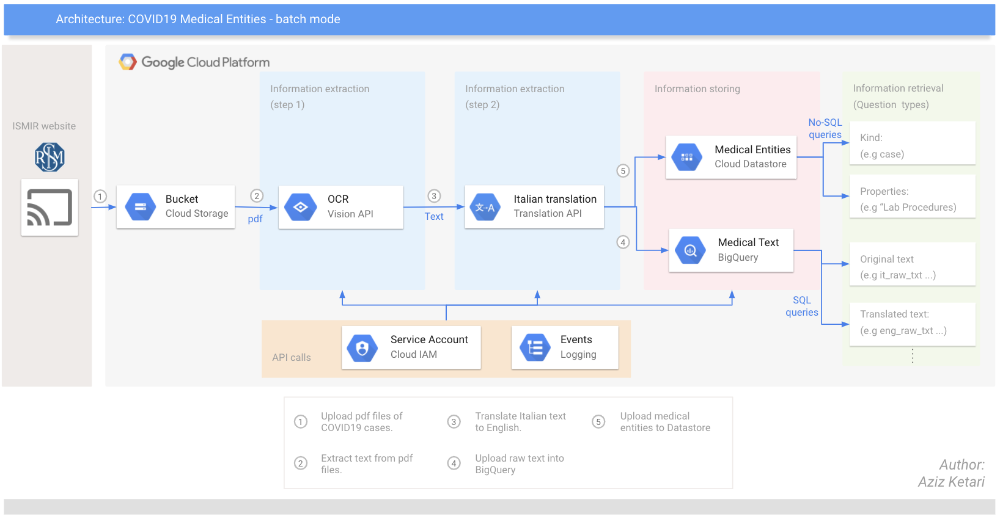

# COVID-19 public dataset on GCP from cases in Italy
> by the Italian Society of Medical and Interventional Radiology (ISMIR)

This repository contains all the code required to extract relevant information from pdf documents published by ISMIR 
and store raw data in  a relational database and entities in a No-SQL database.

In particular, you will use Google Cloud Vision API and Translation API, before storing the information on BigQuery. 
Separately, you will also use specific NER models (from Scispacy) to extract (medical) domain specific entities and 
store them in a NoSQL db (namely Datastore) on Google Cloud Platform.

**Looking for more context behind this dataset? Check out this 
[article](https://medium.com/@ak3776/covid-19-public-dataset-on-gcp-from-cases-in-italy-193e628fa5cb).**

Google Cloud Architecture of the pipeline:


Quick sneak peak on the Entity dataset on Datastore:


---

## Installation
You can replicate this pipeline directly on your local machine or on the cloud shell on GCP.
 
**Requirements:**
- Clone this repo to your local machine using https://github.com/azizketari/covid19_ISMIR.git
- You need a Google Cloud project and IAM rights to create service accounts.
- Create and Download the json key associated with your Service Account. Useful [link](https://cloud.google.com/iam/docs/creating-managing-service-account-keys#iam-service-account-keys-create-python)
- Modify the values to each variables in env_variables.sh file then run
```
source env_variables.sh
```

- Set the project that you will be working on:

`gcloud config set project $PROJECT_ID`

- Enable APIs:
```
gcloud services enable vision.googleapis.com
gcloud services enable translate.googleapis.com
gcloud services enable datastore.googleapis.com
gcloud services enable bigquery.googleapis.com
```

- Install package requirements:curl -O https://bootstrap.pypa.io/get-pip.py
sudo python3 get-pip.py
> Make sure you have a python version >=3.6.0. Otherwise you will face some version errors [Useful link](https://stackoverflow.com/questions/47273260/google-cloud-compute-engine-change-to-python-3-6)

`ERROR: Package 'scispacy' requires a different Python: 3.5.3 not in '>=3.6.0'`

```
cd ~/covid19_ISMIR
pip3 install --user -r requirements.txt
```

Note:

You will also need to download a Named Entity Recognition model for the second part of this pipeline. See Scispacy full selection of 
available models [here](https://allenai.github.io/scispacy/). If you follow this installation guide, the steps 
will automatically download a model for you and install it.


## Extracting data

- **Step 1:** Download the required files to your bucket and load the required model in your local  
(this step will take ~10 min)
> Optional: If you have already downloaded the scispacy model, you should modify the file ./content/download_content.sh to not repeat that step
```
source ./content/download_content.sh
pip install -U ./scispacy_models/en_core_sci_lg-0.2.4.tar.gz
```

- **Step 2:** Start the extraction of text from the pdf documents  

`python3 ./scripts/extraction.py`

## Pre-processing data
Following the extraction of text, it's time to translate it from Italian to English and curate it.

`python3 ./scripts/preprocessing.py`

## Storing data
Following the pre-processing, it's time to store the data in a more searchable format: a data warehouse - 
[BigQuery](https://cloud.google.com/bigquery) - for the text, and a No-SQL database - 
[Datastore](https://cloud.google.com/datastore) - for the (UMLS) medical entities. 

`python3 ./scripts/storing.py`

## Test
Last but not least, you can query your databases using this script.

`python3 ./scripts/retrieving.py`

---

## Contributing
> To get started...

### Step 1
- **Option 1**
    - 🍴 Fork this repo!    

- **Option 2**
    - 👯 Clone this repo to your local machine using https://github.com/azizketari/covid19_ISMIR.git
    
### Step 2
- **HACK AWAY!** 🔨🔨🔨

### Step 3
- 🔃 Create a new pull request

---

## Citing

- [ScispaCy: Fast and Robust Models for Biomedical Natural Language Processing by Mark Neumann and Daniel King and 
Iz Beltagy and Waleed Ammar (2019)](https://www.semanticscholar.org/paper/ScispaCy%3A-Fast-and-Robust-Models-for-Biomedical-Neumann-King/de28ec1d7bd38c8fc4e8ac59b6133800818b4e29)
  
---
  
## License
[](http://badges.mit-license.org)

- [MIT License](https://opensource.org/licenses/mit-license.php)
